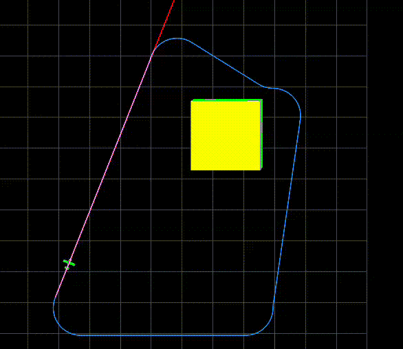
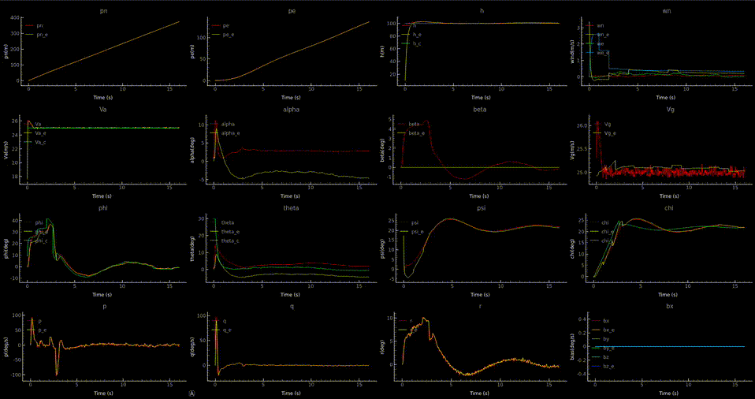

# Mav Sim

This repo contains a docker container embedded and only needs to be built with VSCode.

## Instructions to Run

1. Open the repository in Visual Studio Code.
2. When prompted, open the repository in a dev container.
3. Once the dev container is built and running, open a terminal in VSCode.
4. Execute the following command to run the main script:
    ```sh
    python3 main.py
    ```

## Included GIFs at 4x speed.


Here we show a MAV following a path generated using RRT-Dubins.


Here we show the instruments during the execution, it plots real and estimated results.